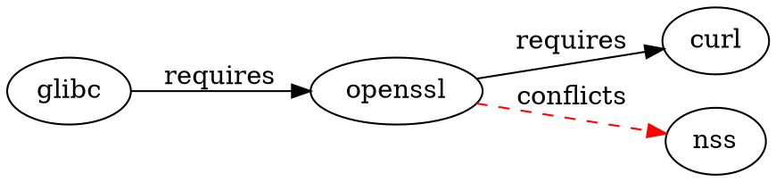

# Plan: `tdnf depgraph` -- A C Source Code Extension for RPM Dependency Graph Export

**Date:** March 10, 2026

---

## Rationale

tdnf already has the complete dependency graph materialized in memory inside the libsolv `Pool` object. Every time `TDNFOpenHandle()` runs, it calls `pool_createwhatprovides()` which builds the full provides-to-solvable index. The graph is *right there* -- it just has no command to export it.

A native C extension is architecturally cleaner than external scripts because it operates in a single process with zero serialization overhead, uses the identical dependency resolution as `tdnf install/update/check`, and includes BuildRequires natively when source repos are loaded.

---

## Where the Graph Lives in the Codebase

In `client/api.c`, after `TDNFOpenHandle()` completes:
- `pTdnf->pSack->pPool` is a fully populated libsolv `Pool`
- `pPool->installed` is the `@System` repo (installed packages)
- `FOR_POOL_SOLVABLES(p)` iterates every known solvable (installed + available)
- For any solvable `s`, `s->requires`, `s->provides`, `s->conflicts`, `s->obsoletes`, `s->recommends`, `s->suggests`, `s->supplements`, `s->enhances` are `Offset` values into `pPool->idarraydata` -- each is a null-terminated array of dependency `Id` values
- `pool_whatprovides(pPool, depId)` returns the solvable IDs that satisfy a given dependency

So the entire directed graph -- nodes are solvables, edges are requires-to-provides resolutions -- can be walked with zero additional I/O.

---

## Architecture: Three-Layer Pattern

tdnf follows a clean pattern: every user-facing command is:
1. A **CLI handler** in `tools/cli/lib/` (parses args, calls the client API, formats output)
2. A **client API function** in `client/` (opens handle, queries solv, returns structs)
3. A **solv-layer function** in `solv/` (walks the Pool)

A `tdnf depgraph` command follows this same three-layer structure.

---

## Layer 1 -- Solv Layer: `solv/tdnfdepgraph.c` (~200 lines)

Walks the `Pool`, resolves every `Requires` dependency via `pool_whatprovides()`, builds an adjacency list in a new `TDNF_DEP_GRAPH` struct. Optionally includes `BuildRequires` if source repos are loaded (source solvables have their `BuildRequires` stored as `Requires`).

### Core Function (pseudocode)

```c
uint32_t
SolvBuildDepGraph(
    PSolvSack pSack,
    PTDNF_DEP_GRAPH *ppGraph
    )
{
    Pool *pool = pSack->pPool;
    Id p;
    Solvable *s;

    // Allocate graph with one node per solvable
    // ...

    FOR_POOL_SOLVABLES(p)
    {
        s = pool_id2solvable(pool, p);

        // Walk s->requires (a null-terminated Id array)
        if (s->requires)
        {
            Id *reqp = pool->idarraydata + s->requires;
            Id req;
            while ((req = *reqp++) != 0)
            {
                // Resolve: who provides this requirement?
                Id pp, provider;
                FOR_PROVIDES(provider, pp, req)
                {
                    // Edge: provider -> p (type: requires)
                    graph_add_edge(pGraph, provider, p,
                                   DEP_EDGE_REQUIRES);
                }
            }
        }

        // Same loop for s->conflicts (DEP_EDGE_CONFLICTS)
        if (s->conflicts)
        {
            Id *conp = pool->idarraydata + s->conflicts;
            Id con;
            while ((con = *conp++) != 0)
            {
                Id pp, provider;
                FOR_PROVIDES(provider, pp, con)
                {
                    graph_add_edge(pGraph, p, provider,
                                   DEP_EDGE_CONFLICTS);
                }
            }
        }

        // Same loop for s->obsoletes (DEP_EDGE_OBSOLETES)
        if (s->obsoletes)
        {
            Id *obsp = pool->idarraydata + s->obsoletes;
            Id obs;
            while ((obs = *obsp++) != 0)
            {
                Id pp, provider;
                FOR_PROVIDES(provider, pp, obs)
                {
                    graph_add_edge(pGraph, p, provider,
                                   DEP_EDGE_OBSOLETES);
                }
            }
        }

        // Same pattern for recommends, suggests,
        // supplements, enhances
    }

    *ppGraph = pGraph;
    return 0;
}
```

The critical point: `FOR_PROVIDES(provider, pp, req)` is a libsolv macro that uses the `whatprovides` index built by `pool_createwhatprovides()`. It resolves versioned dependencies, virtual provides, file provides -- everything. This is the same resolution path `tdnf install` uses, so the graph is guaranteed to be consistent with what the solver would actually compute.

---

## Layer 2 -- Client API: `client/depgraph.c` (~100 lines)

```c
uint32_t
TDNFDepGraph(
    PTDNF pTdnf,
    PTDNF_DEP_GRAPH *ppGraph
    )
{
    uint32_t dwError = 0;

    if (!pTdnf || !pTdnf->pSack || !ppGraph)
    {
        dwError = ERROR_TDNF_INVALID_PARAMETER;
        BAIL_ON_TDNF_ERROR(dwError);
    }

    dwError = TDNFRefresh(pTdnf);
    BAIL_ON_TDNF_ERROR(dwError);

    dwError = SolvBuildDepGraph(pTdnf->pSack, ppGraph);
    BAIL_ON_TDNF_ERROR(dwError);

cleanup:
    return dwError;

error:
    goto cleanup;
}

void
TDNFFreeDepGraph(
    PTDNF_DEP_GRAPH pGraph
    )
{
    if (pGraph)
    {
        for (uint32_t i = 0; i < pGraph->dwNodeCount; i++)
        {
            TDNF_SAFE_FREE_MEMORY(pGraph->pNodes[i].pszName);
            TDNF_SAFE_FREE_MEMORY(pGraph->pNodes[i].pszNevra);
            TDNF_SAFE_FREE_MEMORY(pGraph->pNodes[i].pszRepo);
            // Free edge linked list
            PTDNF_DEP_EDGE pEdge = pGraph->pNodes[i].pEdges;
            while (pEdge)
            {
                PTDNF_DEP_EDGE pNext = pEdge->pNext;
                TDNFFreeMemory(pEdge);
                pEdge = pNext;
            }
        }
        TDNFFreeMemory(pGraph->pNodes);
        TDNFFreeMemory(pGraph);
    }
}
```

---

## Layer 3 -- CLI Handler: `tools/cli/lib/depgraph.c` (~150 lines)

Parses `--json` / `--dot` / `--adjacency` output format flags. For JSON, uses the existing `json_dump` facility (same as `repoquery --json`). For DOT, emits Graphviz format. Registers the command in the CLI dispatch table.

```c
uint32_t
TDNFCliDepGraphCommand(
    PTDNF_CLI_CONTEXT pContext,
    PTDNF_CMD_ARGS pCmdArgs
    )
{
    uint32_t dwError = 0;
    PTDNF_DEP_GRAPH pGraph = NULL;

    dwError = pContext->pFnDepGraph(pContext, &pGraph);
    BAIL_ON_CLI_ERROR(dwError);

    if (pCmdArgs->nJsonOutput)
    {
        dwError = TDNFCliDepGraphPrintJson(pGraph);
    }
    else if (nDotOutput)
    {
        dwError = TDNFCliDepGraphPrintDot(pGraph);
    }
    else
    {
        dwError = TDNFCliDepGraphPrintAdjacency(pGraph);
    }
    BAIL_ON_CLI_ERROR(dwError);

cleanup:
    TDNFFreeDepGraph(pGraph);
    return dwError;

error:
    goto cleanup;
}
```

### JSON output format

```json
{
  "metadata": {
    "generator": "tdnf depgraph",
    "timestamp": "2026-03-10T14:00:00Z",
    "node_count": 1523,
    "edge_count": 12847
  },
  "nodes": [
    {
      "id": 42,
      "name": "openssl",
      "nevra": "openssl-3.3.0-1.ph6.x86_64",
      "repo": "photon-updates",
      "reverse_dep_count": 247
    }
  ],
  "edges": [
    {"from": 17, "to": 42, "type": "requires"},
    {"from": 42, "to": 93, "type": "requires"},
    {"from": 42, "to": 55, "type": "conflicts"}
  ]
}
```

### DOT output format



### Adjacency list output format

```
openssl: glibc zlib krb5
curl: openssl nghttp2 zlib
nginx: openssl pcre2 zlib
```

---

## New Types (in `include/tdnftypes.h`)

```c
typedef enum {
    DEP_EDGE_REQUIRES,
    DEP_EDGE_BUILDREQUIRES,
    DEP_EDGE_RECOMMENDS,
    DEP_EDGE_SUGGESTS,
    DEP_EDGE_SUPPLEMENTS,
    DEP_EDGE_ENHANCES,
    DEP_EDGE_CONFLICTS,
    DEP_EDGE_OBSOLETES
} TDNF_DEP_EDGE_TYPE;

typedef struct _TDNF_DEP_EDGE {
    uint32_t dwFromId;
    uint32_t dwToId;
    TDNF_DEP_EDGE_TYPE nType;
    struct _TDNF_DEP_EDGE *pNext;
} TDNF_DEP_EDGE, *PTDNF_DEP_EDGE;

typedef struct _TDNF_DEP_GRAPH_NODE {
    char *pszName;
    char *pszNevra;
    char *pszRepo;
    uint32_t dwReverseDepCount;
    PTDNF_DEP_EDGE pEdges;
} TDNF_DEP_GRAPH_NODE, *PTDNF_DEP_GRAPH_NODE;

typedef struct _TDNF_DEP_GRAPH {
    uint32_t dwNodeCount;
    PTDNF_DEP_GRAPH_NODE pNodes;
} TDNF_DEP_GRAPH, *PTDNF_DEP_GRAPH;
```

---

## Public API Addition (in `include/tdnf.h`)

```c
uint32_t
TDNFDepGraph(
    PTDNF pTdnf,
    PTDNF_DEP_GRAPH *ppGraph
    );

void
TDNFFreeDepGraph(
    PTDNF_DEP_GRAPH pGraph
    );
```

---

## Build Integration

- Add `solv/tdnfdepgraph.c` to `solv/CMakeLists.txt`
- Add `client/depgraph.c` to `client/CMakeLists.txt`
- Add `tools/cli/lib/depgraph.c` to `tools/cli/CMakeLists.txt`
- Register `"depgraph"` in the CLI command dispatch table (in `tools/cli/lib/parseargs.c`)
- Add prototypes to `solv/prototypes.h` and `client/prototypes.h`

---

## BuildRequires: No Gap When Source Repos Are Enabled

When a Photon OS source repo is enabled in `/etc/yum.repos.d/`:

```ini
[photon-sources]
name=Photon OS 6.0 Source Packages
baseurl=https://packages.vmware.com/photon/6.0/photon_srpms_6.0_x86_64/
enabled=1
gpgcheck=0
```

Source RPMs (`.src.rpm`) are loaded into the Pool as solvables. Their `s->requires` field contains the **BuildRequires** from the original `.spec` file. The `SolvBuildDepGraph()` function can detect source solvables (their arch is `"src"`) and tag their requirement edges as `DEP_EDGE_BUILDREQUIRES` instead of `DEP_EDGE_REQUIRES`:

```c
const char *pszArch = pool_id2str(pool, s->arch);
TDNF_DEP_EDGE_TYPE edgeType =
    (strcmp(pszArch, "src") == 0) ? DEP_EDGE_BUILDREQUIRES
                                  : DEP_EDGE_REQUIRES;
```

This eliminates the spec-file parsing fallback entirely.

---

## Estimated Size

| File | Lines | Purpose |
|---|---|---|
| `solv/tdnfdepgraph.c` | ~200 | Pool walk, edge resolution via `FOR_PROVIDES` |
| `client/depgraph.c` | ~100 | API entry point, refresh, delegation, free |
| `tools/cli/lib/depgraph.c` | ~150 | Arg parsing, JSON/DOT/adjacency serialization |
| Type additions in headers | ~40 | Structs and enums in `tdnftypes.h`, `tdnf.h` |
| CMake / dispatch table changes | ~15 | Build integration |
| **Total** | **~505** | |

This is approximately the same size as the existing `repoquery` implementation and follows the exact same architectural pattern.

---

## Why This Is Better Than External Scripts

| Aspect | External scripts | Native `tdnf depgraph` |
|---|---|---|
| Process overhead | Multiple subprocess spawns, JSON parse/serialize per package | Single process, in-memory Pool walk |
| Dependency resolution | Re-parses tdnf JSON output, must rebuild provides index | Uses libsolv `FOR_PROVIDES` -- identical to solver |
| BuildRequires | Requires spec-file parsing fallback | Natively from source solvables in Pool |
| Consistency guarantee | May diverge from solver behavior | Identical code path as `tdnf install/update/check` |
| Virtual provides | Must re-implement resolution | Handled by `pool_whatprovides()` |
| Rich deps (if/unless) | Must parse RPM boolean syntax | Handled by libsolv |
| Sub-packages | Must reconstruct from NEVRA | Each is a distinct solvable |
| Reusability | Custom scripts per consumer | `tdnf depgraph --json` -- standard CLI command |

---

## Submission Path

This extension adds a new command without modifying any existing code paths. It could be submitted as a pull request to `vmware/tdnf` (https://github.com/vmware/tdnf). The PR would contain 5 new files and minor additions to 4 existing files (headers, CMakeLists, dispatch table).

---

## Usage Examples

```bash
# Full JSON graph for QUBO builder consumption
tdnf depgraph --json > dependency-graph.json

# Graphviz visualization
tdnf depgraph --dot | dot -Tsvg -o photon6-deps.svg

# Compact adjacency list
tdnf depgraph --adjacency > deps.txt

# Include BuildRequires (source repo must be enabled)
tdnf depgraph --json --source > full-graph-with-buildrequires.json

# Filter to specific packages
tdnf depgraph --json openssl curl gnutls > crypto-subgraph.json
```
